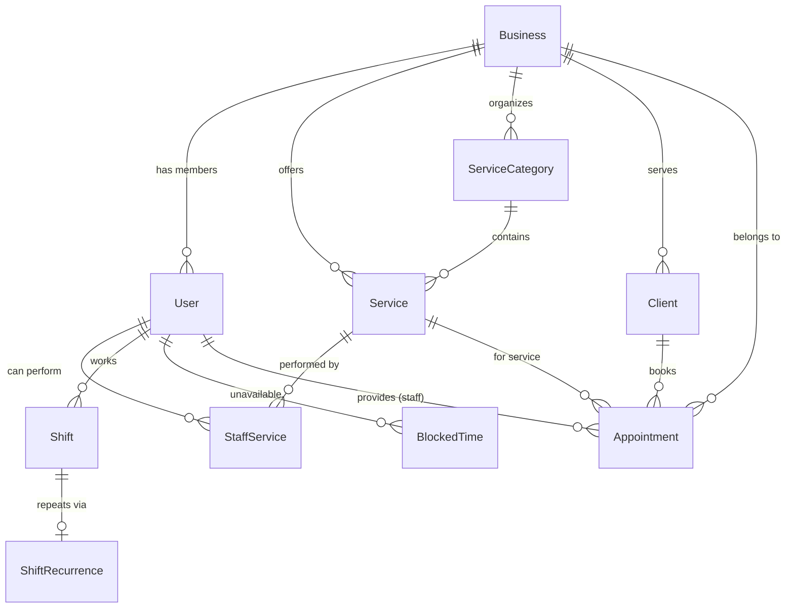
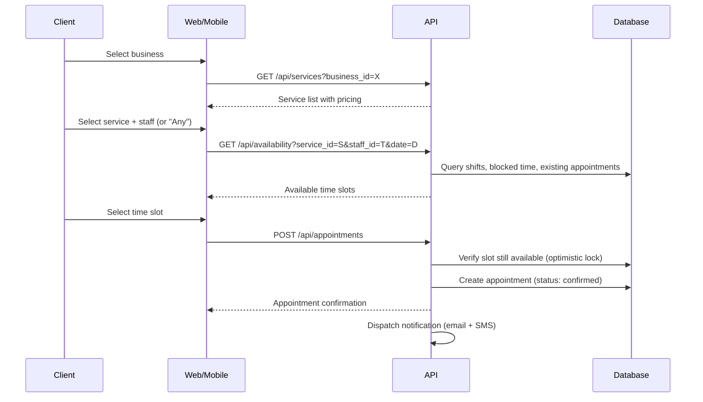
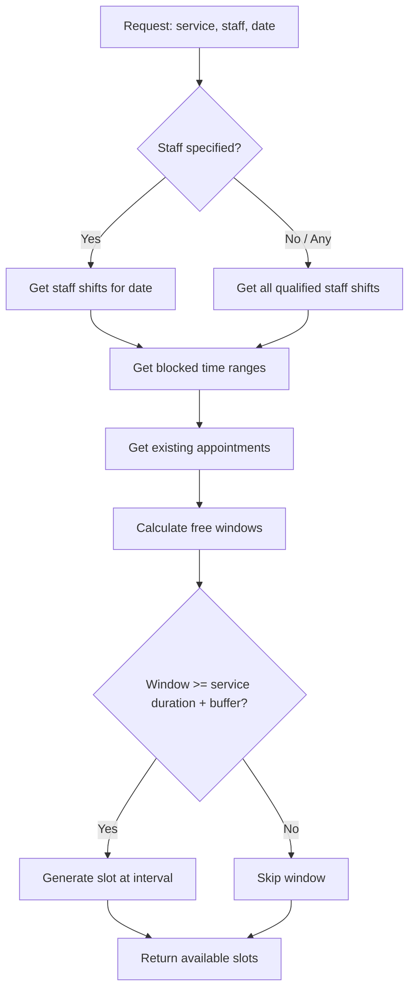

# Architecture

## Overview

GlowNow is a multi-tenant SaaS platform for booking and business management in the beauty/wellness industry. The codebase is organized as a **Turborepo monorepo** combining TypeScript (web, mobile, shared packages) with C#/.NET (API).

| Layer    | Technology                          |
| -------- | ----------------------------------- |
| Web      | Next.js 16, React 19, CSS Modules  |
| Mobile   | Expo 54, React Native 0.81         |
| API      | .NET 10, Clean Architecture        |
| Monorepo | Turborepo 2.8, npm workspaces      |
| Language | TypeScript 5.9, C# 14              |

## Repository structure

```
GlowNow/
├── apps/
│   ├── api/                  # .NET 10 API (Clean Architecture)
│   │   ├── src/
│   │   │   ├── GlowNow.Api/           # Host, DI, endpoints
│   │   │   ├── GlowNow.Application/   # Use cases, interfaces
│   │   │   ├── GlowNow.Domain/        # Entities, value objects
│   │   │   └── GlowNow.Infrastructure/# External concerns, persistence
│   │   ├── Directory.Build.props       # Shared .NET project settings
│   │   └── GlowNow.Api.sln
│   ├── mobile/               # Expo / React Native app
│   └── web/                  # Next.js 16 web app
├── packages/
│   ├── eslint-config/        # Shared ESLint v9 flat configs
│   ├── typescript-config/    # Shared tsconfig bases
│   └── ui/                   # Shared React component library
├── docs/
│   └── PRD.md                # Product requirements
├── turbo.json                # Turborepo pipeline config
└── package.json              # Root workspaces & scripts
```

## Turborepo pipeline

Defined in `turbo.json`:

- **build** — `dependsOn: ["^build"]`. Upstream packages build first. Outputs: `.next/**`, .NET `bin/`/`obj/`.
- **lint** — `dependsOn: ["^lint"]`. Upstream packages lint first.
- **check-types** — `dependsOn: ["^check-types"]`. Upstream packages type-check first.
- **dev** — No caching, persistent. Runs all dev servers in parallel.

## Apps

### `@glownow/web` — Web application

- **Framework**: Next.js 16 with App Router
- **UI**: React 19, CSS Modules
- **Port**: 3000
- **Lint**: ESLint v9 with `--max-warnings 0` (zero tolerance)
- **Dependencies**: `@glownow/ui`, `@glownow/eslint-config`, `@glownow/typescript-config`

### `@glownow/api` — API

- **Framework**: .NET 10 minimal API
- **Architecture**: Clean Architecture with four projects:
  - **Api** — Host, dependency injection, endpoint mapping
  - **Application** — Use cases, service interfaces
  - **Domain** — Entities, value objects, domain logic
  - **Infrastructure** — External integrations, persistence
- **Port**: 5249
- **Endpoints**: `GET /health` (health check)
- **Shared props**: `Directory.Build.props` enforces `net10.0`, nullable enabled, implicit usings, warnings-as-errors

### `@glownow/mobile` — Mobile application

- **Framework**: Expo 54, React Native 0.81
- **Template**: blank-typescript
- **React**: 19.1

## Packages

### `@glownow/ui` — Component library

Shared React components consumed by the web app. Exports raw `.tsx` files via the `exports` field (`"./*": "./src/*.tsx"`), so consumers compile them directly.

Components: `button`, `card`, `code`

### `@glownow/eslint-config` — ESLint configuration

Flat ESLint v9 configs with three presets:

| Config            | Purpose                        |
| ----------------- | ------------------------------ |
| `base.js`         | Base rules + typescript-eslint |
| `next.js`         | Next.js specific rules         |
| `react-internal.js` | Internal React libraries    |

Uses `eslint-plugin-turbo`, `typescript-eslint`, `eslint-config-prettier`, and `eslint-plugin-only-warn` (converts errors to warnings; zero-warning enforcement is at the script level).

### `@glownow/typescript-config` — TypeScript configuration

Shared `tsconfig` bases:

| Config              | Purpose                    |
| ------------------- | -------------------------- |
| `base.json`         | Strict mode, common paths  |
| `nextjs.json`       | Next.js app settings       |
| `react-library.json`| React library settings     |

## Dependency graph

```
┌─────────────────────────────────────────────────────────┐
│                     Turborepo (npm workspaces)          │
│                                                         │
│  ┌──────────┐   ┌──────────┐   ┌───────────────────┐   │
│  │   web    │   │  mobile  │   │       api         │   │
│  │ (Next.js)│   │ (Expo)   │   │  (.NET solution)  │   │
│  └────┬─────┘   └──────────┘   └───────────────────┘   │
│       │                         │                       │
│       ▼                         ▼ (.NET project refs)   │
│  ┌─────────┐              Api ──► Application           │
│  │   ui    │              Api ──► Infrastructure         │
│  └─────────┘              Infrastructure ──► Application │
│       │                   Application ──► Domain         │
│  Uses:│                                                 │
│  eslint-config                                          │
│  typescript-config                                      │
└─────────────────────────────────────────────────────────┘
```

## Key conventions

- **Strict TypeScript** enabled across all packages
- **Zero-warning lint policy** enforced via `--max-warnings 0`
- **Warnings-as-errors** in .NET via `Directory.Build.props`
- **CSS Modules** for styling in the web app (no CSS-in-JS)
- **Clean Architecture** in .NET: dependencies point inward (Api/Infrastructure → Application → Domain)
- **Direct TSX exports** from the UI package (no pre-compilation step)
- **No test framework** configured yet

## Development commands

| Command                                    | Description                  |
| ------------------------------------------ | ---------------------------- |
| `npm run dev`                              | Start all apps               |
| `npx turbo dev --filter=@glownow/web`     | Start web app (port 3000)    |
| `npx turbo dev --filter=@glownow/api`     | Start API (port 5249)        |
| `npm run build`                            | Build all apps               |
| `npm run lint`                             | Lint all packages            |
| `npm run check-types`                      | Type-check all packages      |
| `npm run format`                           | Prettier on .ts/.tsx/.md     |
| `dotnet build GlowNow.Api.sln`            | Build .NET solution directly |

---

## Target architecture (planned)

> **Note:** Everything below this line describes the **planned/target** architecture. It has not been implemented yet. The sections above reflect the current state of the codebase.

### Modular monolith evolution

The current Clean Architecture scaffold (Api / Application / Domain / Infrastructure) will evolve into a **modular monolith** with domain-specific modules. Each module owns its entities, use cases, and infrastructure while sharing the same deployment unit.

**Planned domain modules:**

| Module | Responsibility |
|--------|---------------|
| Identity | Authentication, authorization, user management |
| Business | Business registration, settings, operating hours |
| Catalog | Services, categories, pricing |
| Team | Staff profiles, permissions, service assignments |
| Booking | Availability calculation, appointments, scheduling |
| Clients | Client profiles, booking history |
| Notifications | Email/SMS dispatch, templates, delivery tracking |
| Shared | Cross-cutting: multi-tenancy, audit, common value objects |

**Planned `src/` structure:**

```
apps/api/src/
├── GlowNow.Api/                  # Host, DI, middleware, endpoint mapping
├── GlowNow.Application/          # Shared application abstractions
├── GlowNow.Domain/               # Shared domain primitives
├── GlowNow.Infrastructure/       # Shared infra (EF Core, email, SMS)
└── Modules/
    ├── GlowNow.Identity/
    ├── GlowNow.Business/
    ├── GlowNow.Catalog/
    ├── GlowNow.Team/
    ├── GlowNow.Booking/
    ├── GlowNow.Clients/
    └── GlowNow.Notifications/
```

### Multi-tenancy strategy

- **Approach:** Shared database with `business_id` discriminator column on all tenant-scoped tables
- **Enforcement:** EF Core global query filters automatically apply `WHERE business_id = @current` to all tenant-scoped queries
- **Resolution:** `X-Business-Id` HTTP header, validated against the authenticated user's business memberships
- **Isolation guarantee:** Row-level filtering — no tenant can access another tenant's data

---

## Data model (planned)

### Core entities

| Entity | Description |
|--------|-------------|
| **Business** | Tenant: name, RUC, address (parish), operating hours, timezone, cancellation policy |
| **User** | Platform user: email, password hash, phone, role per business |
| **Service** | Offered service: name, description, duration, price, processing time, buffer time |
| **ServiceCategory** | Groups services (e.g., "Hair", "Nails") |
| **StaffService** | Many-to-many: which staff can perform which services (optional custom duration/price) |
| **Shift** | Staff working block: staff_id, day_of_week, start/end time |
| **ShiftRecurrence** | Repeating shift pattern: recurrence type, start/end dates |
| **BlockedTime** | Staff unavailability: vacation, break, meeting |
| **Client** | Business-scoped client record: name, phone, email, notes |
| **Appointment** | Booked slot: service, staff, client, start/end time, status |

### Key enums

```
user_role:            owner | manager | staff | receptionist | client
appointment_status:   pending | confirmed | in_progress | completed | cancelled | no_show
booked_by:            client_online | staff_manual | walk_in
recurrence_pattern:   none | daily | weekly | biweekly | monthly
```

### ER diagram



---

## API design (planned)

### Authentication

- **Method:** JWT Bearer tokens (RS256)
- **Token lifetime:** 24 hours
- **Refresh:** Rotating refresh tokens (single-use, stored server-side)
- **Multi-tenancy header:** `X-Business-Id` (required for all tenant-scoped endpoints)

### Core endpoint groups

| Group | Base path | Key operations |
|-------|-----------|---------------|
| Auth | `/api/auth` | Register, login, refresh, logout, me |
| Business | `/api/businesses` | Create, get, update settings, operating hours |
| Services | `/api/services` | CRUD services, categories, staff assignments |
| Team | `/api/team` | Invite member, list staff, update role, manage shifts |
| Availability | `/api/availability` | Get available slots (public, no auth required) |
| Appointments | `/api/appointments` | Book, reschedule, cancel, mark no-show, list |
| Clients | `/api/clients` | CRUD client records, search by phone/name, booking history |

### Standard response format

```json
{
  "data": { },
  "meta": {
    "timestamp": "2026-01-15T10:30:00Z",
    "requestId": "uuid"
  }
}
```

### Standard error format

```json
{
  "error": {
    "code": "VALIDATION_ERROR",
    "message": "Human-readable description",
    "details": [
      { "field": "email", "message": "Invalid email format" }
    ]
  }
}
```

### HTTP status codes

| Code | Usage |
|------|-------|
| 200 | Success (GET, PUT, PATCH) |
| 201 | Created (POST) |
| 204 | No content (DELETE) |
| 400 | Validation error |
| 401 | Unauthenticated |
| 403 | Forbidden (wrong role / wrong tenant) |
| 404 | Resource not found |
| 409 | Conflict (double booking, duplicate) |
| 429 | Rate limited |
| 500 | Internal server error |

---

## Key flows (planned)

### Online booking flow



### Availability calculation



---

## Infrastructure (planned)

> **Status:** Not yet implemented. AWS account setup is pending.

### Planned AWS stack

| Service | Purpose |
|---------|---------|
| ECS Fargate | Container hosting for .NET API |
| RDS PostgreSQL | Primary database (multi-AZ in production) |
| S3 | Static assets, business logos, file uploads |
| CloudFront | CDN for web app and S3 assets |
| ALB | Application load balancer with HTTPS termination |
| SES / Twilio | Email and SMS notification delivery |
| CloudWatch | Logging, metrics, alarms |

### Planned Terraform structure

```
infra/
├── modules/
│   ├── networking/    # VPC, subnets, security groups
│   ├── ecs/           # Fargate service, task definitions
│   ├── rds/           # PostgreSQL instance
│   ├── s3/            # Buckets and policies
│   └── cdn/           # CloudFront distribution
├── environments/
│   ├── dev/
│   ├── staging/
│   └── production/
└── main.tf
```

### Environment tiers

| Environment | Purpose | Database | Infrastructure |
|-------------|---------|----------|---------------|
| dev | Local development | Local PostgreSQL (Docker) | Docker Compose |
| staging | Pre-production testing | RDS (single instance) | ECS Fargate |
| production | Live platform | RDS (multi-AZ) | ECS Fargate (auto-scaling) |

---

## Security (planned)

### Authentication & authorization

- **Password hashing:** bcrypt with work factor 12
- **JWT signing:** RS256 (asymmetric keys)
- **Refresh tokens:** Single-use, rotating, stored server-side with expiry
- **Role enforcement:** Policy-based authorization checked at endpoint level

### API security

- **Rate limiting:** Per-IP and per-user token bucket
- **Input validation:** FluentValidation on all request DTOs
- **CORS:** Whitelist of allowed origins (web app domain only)
- **Headers:** Standard security headers (HSTS, X-Content-Type-Options, X-Frame-Options)

### Data security

- **In transit:** TLS 1.3 enforced on all connections
- **At rest:** RDS encryption enabled (AES-256)
- **Audit logging:** All write operations logged with user_id, business_id, timestamp
- **Tenant isolation:** EF Core global filters + integration tests verifying cross-tenant queries return empty
