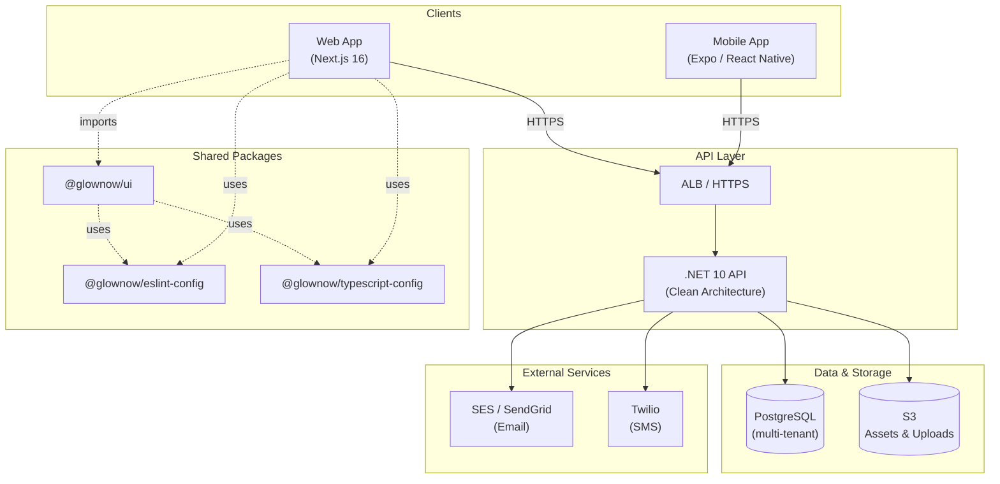
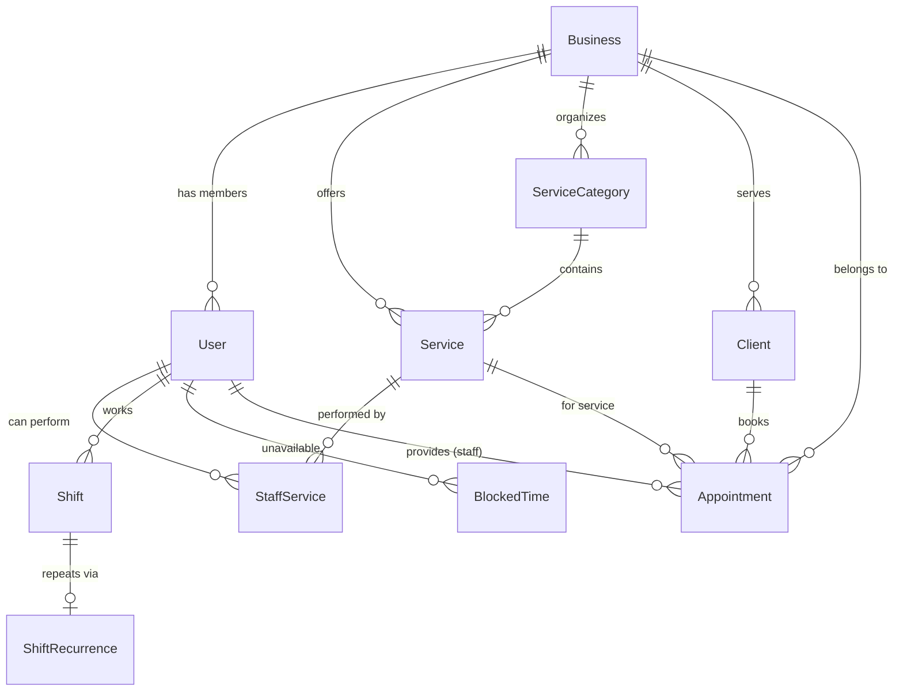
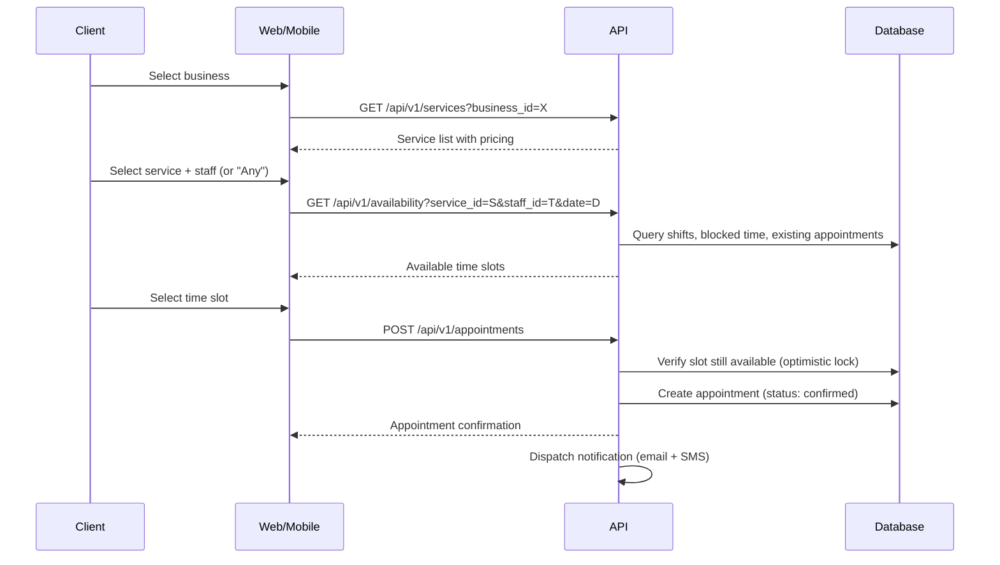
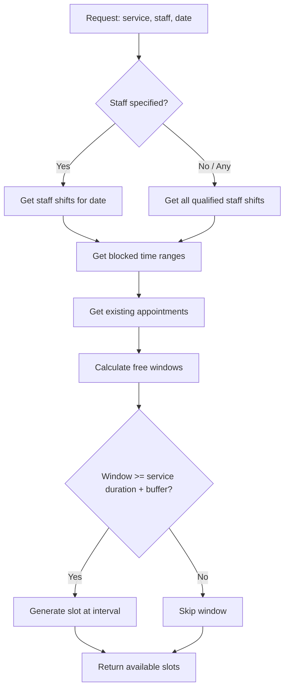

# Architecture

## Overview

GlowNow is a multi-tenant SaaS platform for booking and business management in the beauty/wellness industry. The codebase is organized as a **Turborepo monorepo** combining TypeScript (web, mobile, shared packages) with C#/.NET (API).

| Layer    | Technology                          |
| -------- | ----------------------------------- |
| Web      | Next.js 16, React 19, CSS Modules  |
| Mobile   | Expo 54, React Native 0.81         |
| API      | .NET 10, Clean Architecture        |
| Monorepo | Turborepo 2.8, npm workspaces      |
| Language | TypeScript 5.9, C# 14              |

## System diagram



> **Solid lines** = runtime communication. **Dashed lines** = build-time dependencies. Data stores marked with `(multi-tenant)` use `business_id` row-level filtering. External services and infrastructure (ALB, PostgreSQL, S3) are **planned** — see [Infrastructure](#infrastructure-planned).

## Repository structure

```
GlowNow/
├── apps/
│   ├── api/                  # .NET 10 API (Modular Monolith)
│   │   ├── src/
│   │   │   ├── Api/
│   │   │   │   └── GlowNow.Api/         # Composition root, DI, middleware
│   │   │   ├── Core/
│   │   │   │   ├── GlowNow.SharedKernel/        # Domain primitives
│   │   │   │   └── GlowNow.Infrastructure.Core/ # Cross-cutting behaviors
│   │   │   └── Modules/
│   │   │       ├── Identity/            # Auth, JWT, users, roles
│   │   │       │   ├── GlowNow.Identity.Domain/
│   │   │       │   ├── GlowNow.Identity.Application/
│   │   │       │   ├── GlowNow.Identity.Infrastructure/
│   │   │       │   └── GlowNow.Identity.Api/
│   │   │       ├── Business/            # Tenant registration, settings
│   │   │       ├── Catalog/             # Services, categories, pricing
│   │   │       ├── Team/                # Staff, shifts, availability
│   │   │       ├── Clients/             # Client profiles, history
│   │   │       ├── Booking/             # Appointments, scheduling
│   │   │       └── Notifications/       # Email/SMS dispatch
│   │   ├── tests/
│   │   │   ├── GlowNow.UnitTests/       # xUnit unit tests per module
│   │   │   ├── GlowNow.IntegrationTests/# Testcontainers integration tests
│   │   │   └── GlowNow.ApiTests/        # WebApplicationFactory API tests
│   │   ├── Directory.Build.props        # Shared .NET project settings
│   │   └── GlowNow.Api.sln
│   ├── mobile/               # Expo / React Native app
│   └── web/                  # Next.js 16 web app
├── packages/
│   ├── eslint-config/        # Shared ESLint v9 flat configs
│   ├── typescript-config/    # Shared tsconfig bases
│   └── ui/                   # Shared React component library
├── docs/
│   ├── ARCHITECTURE.md       # This file
│   ├── ai/current-state.md   # Development status tracker
│   └── PRD.md                # Product requirements
├── turbo.json                # Turborepo pipeline config
└── package.json              # Root workspaces & scripts
```

## Turborepo pipeline

Defined in `turbo.json`:

- **build** — `dependsOn: ["^build"]`. Upstream packages build first. Outputs: `.next/**`, .NET `bin/`/`obj/`.
- **lint** — `dependsOn: ["^lint"]`. Upstream packages lint first.
- **check-types** — `dependsOn: ["^check-types"]`. Upstream packages type-check first.
- **dev** — No caching, persistent. Runs all dev servers in parallel.

## Apps

### `@glownow/web` — Web application

- **Framework**: Next.js 16 with App Router
- **UI**: React 19, CSS Modules
- **Port**: 3000
- **Lint**: ESLint v9 with `--max-warnings 0` (zero tolerance)
- **Dependencies**: `@glownow/ui`, `@glownow/eslint-config`, `@glownow/typescript-config`

### `@glownow/api` — API

- **Framework**: .NET 10 with MVC Controllers
- **Stack**: PostgreSQL, EF Core, MediatR (CQRS), FluentValidation, Scalar (OpenAPI)
- **Architecture**: Modular monolith with 4-project-per-module Clean Architecture:
  - **Core/GlowNow.SharedKernel** — Domain primitives (Entity, AggregateRoot, ValueObject, Result, Error)
  - **Core/GlowNow.Infrastructure.Core** — Cross-cutting behaviors, interfaces, providers
  - **Modules/{Module}/** — Each module has 4 projects:
    - `GlowNow.{Module}.Domain` — Entities, value objects, events, errors
    - `GlowNow.{Module}.Application` — Commands, queries, handlers, validators
    - `GlowNow.{Module}.Infrastructure` — EF Core, repositories, external services
    - `GlowNow.{Module}.Api` — MVC controllers, module DI registration
- **Port**: 5249
- **Endpoints**: `GET /health` (liveness), `GET /health/ready` (readiness — DB, external services)
- **Shared props**: `Directory.Build.props` enforces `net10.0`, nullable enabled, implicit usings, warnings-as-errors
- **Testing**: xUnit + NSubstitute (unit), Testcontainers (integration), WebApplicationFactory (end-to-end)

### `@glownow/mobile` — Mobile application

- **Framework**: Expo 54, React Native 0.81
- **Template**: blank-typescript
- **React**: 19.1

## Packages

### `@glownow/ui` — Component library

Shared React components consumed by the web app. Exports raw `.tsx` files via the `exports` field (`"./*": "./src/*.tsx"`), so consumers compile them directly.

Components: `button`, `card`, `code`

### `@glownow/eslint-config` — ESLint configuration

Flat ESLint v9 configs with three presets:

| Config            | Purpose                        |
| ----------------- | ------------------------------ |
| `base.js`         | Base rules + typescript-eslint |
| `next.js`         | Next.js specific rules         |
| `react-internal.js` | Internal React libraries    |

Uses `eslint-plugin-turbo`, `typescript-eslint`, `eslint-config-prettier`, and `eslint-plugin-only-warn` (converts errors to warnings; zero-warning enforcement is at the script level).

### `@glownow/typescript-config` — TypeScript configuration

Shared `tsconfig` bases:

| Config              | Purpose                    |
| ------------------- | -------------------------- |
| `base.json`         | Strict mode, common paths  |
| `nextjs.json`       | Next.js app settings       |
| `react-library.json`| React library settings     |

## Dependency graph

```
┌─────────────────────────────────────────────────────────┐
│                     Turborepo (npm workspaces)          │
│                                                         │
│  ┌──────────┐   ┌──────────┐   ┌───────────────────┐   │
│  │   web    │   │  mobile  │   │       api         │   │
│  │ (Next.js)│   │ (Expo)   │   │  (.NET solution)  │   │
│  └────┬─────┘   └──────────┘   └───────────────────┘   │
│       │                         │                       │
│       ▼                         ▼ (4-project-per-module)│
│  ┌─────────┐              GlowNow.Api (host)            │
│  │   ui    │                  │                         │
│  └─────────┘              ┌───┴───┐                     │
│       │                   ▼       ▼                     │
│  Uses:│              Core     Modules/{Module}/         │
│  eslint-config       │         ├── Domain               │
│  typescript-config   │         ├── Application          │
│                      │         ├── Infrastructure       │
│               SharedKernel     └── Api                  │
│               Infrastructure.Core                       │
└─────────────────────────────────────────────────────────┘
```

## Key conventions

- **Strict TypeScript** enabled across all packages
- **Zero-warning lint policy** enforced via `--max-warnings 0`
- **Warnings-as-errors** in .NET via `Directory.Build.props`
- **CSS Modules** for styling in the web app (no CSS-in-JS)
- **Modular monolith** in .NET: domain-specific modules with Clean Architecture per module (Domain ← Application ← Infrastructure)
- **Direct TSX exports** from the UI package (no pre-compilation step)
- **xUnit** for testing (unit, integration, API), with NSubstitute for mocking and Testcontainers for database tests

## Development commands

| Command                                    | Description                  |
| ------------------------------------------ | ---------------------------- |
| `npm run dev`                              | Start all apps               |
| `npx turbo dev --filter=@glownow/web`     | Start web app (port 3000)    |
| `npx turbo dev --filter=@glownow/api`     | Start API (port 5249)        |
| `npm run build`                            | Build all apps               |
| `npm run lint`                             | Lint all packages            |
| `npm run check-types`                      | Type-check all packages      |
| `npm run format`                           | Prettier on .ts/.tsx/.md     |
| `dotnet build GlowNow.Api.sln`            | Build .NET solution directly |

---

## Modular monolith architecture

### Domain modules

Each module is a self-contained vertical slice owning its entities, use cases, and infrastructure while sharing the same deployment unit.

**Modules:**

| Module | Responsibility |
|--------|---------------|
| Identity | Authentication, authorization, user management |
| Business | Business registration, settings, operating hours |
| Catalog | Services, categories, pricing |
| Team | Staff profiles, permissions, service assignments |
| Booking | Availability calculation, appointments, scheduling |
| Clients | Client profiles, booking history |
| Notifications | Email/SMS dispatch, templates, delivery tracking |
| Shared | Cross-cutting: multi-tenancy, audit, common value objects |

**Module dependency order (top depends on bottom):**

```
Booking → Team, Catalog, Clients
Team → Identity, Catalog
Clients → Identity (optional)
Identity, Business, Catalog → Shared only
Notifications → Shared only (listens to domain events)
Shared → nothing (foundation)
```

Dependencies are **acyclic** — never create circular references between modules. Modules communicate via **direct service interfaces** (synchronous) or **domain events** (asynchronous).

**`src/` structure (4-project-per-module):**

```
apps/api/src/
├── Api/
│   └── GlowNow.Api/              # Composition root, DI, middleware
├── Core/
│   ├── GlowNow.SharedKernel/     # Domain primitives (Entity, Result, ValueObject)
│   └── GlowNow.Infrastructure.Core/  # Cross-cutting (behaviors, interfaces)
└── Modules/
    ├── Identity/
    │   ├── GlowNow.Identity.Domain/
    │   ├── GlowNow.Identity.Application/
    │   ├── GlowNow.Identity.Infrastructure/
    │   └── GlowNow.Identity.Api/
    ├── Business/                 # (same 4-project layout)
    ├── Catalog/
    ├── Team/
    ├── Clients/
    ├── Booking/
    └── Notifications/
```

**Per-module project organization:**

```
Modules/{Module}/
├── GlowNow.{Module}.Domain/
│   ├── Entities/              # Aggregate roots and entities
│   ├── ValueObjects/          # Module-specific value objects
│   ├── Events/                # Domain events
│   ├── Enums/                 # Domain enumerations
│   ├── Errors/                # Domain error definitions
│   └── Services/              # Domain services (pure logic)
├── GlowNow.{Module}.Application/
│   ├── Commands/              # One folder per command (Command + Handler + Validator)
│   ├── Queries/               # One folder per query (Query + Handler + Response)
│   ├── Interfaces/            # Port interfaces (repositories, external services)
│   ├── Mappings/              # Entity ↔ Response mappings
│   └── EventHandlers/         # Handlers for domain events from other modules
├── GlowNow.{Module}.Infrastructure/
│   ├── Persistence/
│   │   ├── Configurations/    # EF Core entity configurations (Fluent API)
│   │   ├── Repositories/      # Repository implementations
│   │   └── Migrations/        # EF Core migrations (module-specific DbContext)
│   ├── Services/              # External service implementations
│   └── DependencyInjection.cs # Infrastructure DI registration
└── GlowNow.{Module}.Api/
    ├── Controllers/           # MVC controllers
    ├── Infrastructure/        # API helpers (ResultExtensions, ApiResponse)
    └── {Module}Module.cs      # Module DI registration entry point
```

### Multi-tenancy strategy

- **Approach:** Shared database with `business_id` discriminator column on all tenant-scoped tables
- **Enforcement:** EF Core global query filters automatically apply `WHERE business_id = @current` to all tenant-scoped queries
- **Resolution:** `X-Business-Id` HTTP header, validated against the authenticated user's business memberships
- **Isolation guarantee:** Row-level filtering — no tenant can access another tenant's data

### Domain-Driven Design

- **Entities** have identity (`Entity<TId>`), encapsulate behavior, and protect invariants — no anemic models.
- **Value Objects** are immutable, compared by value (e.g., `PhoneNumber`, `RUC`, `Email`, `Money`).
- **Aggregate Roots** (`AggregateRoot<TId>`) are the only entry points for persistence operations.
- **Domain Events** signal something meaningful happened (e.g., `AppointmentConfirmedEvent`, `BusinessRegisteredEvent`).
- **Domain Services** handle logic that doesn't belong to a single entity.

### CQRS with MediatR

Every use case is a **Command** (write) or **Query** (read) dispatched through MediatR. One file per command/query, one file per handler, one file per validator, grouped in a folder.

- Commands return `Result<T>` or `Result` (never throw for business rule violations).
- Queries return DTOs/response records, never domain entities.
- Validators use FluentValidation and run automatically via MediatR pipeline behavior.

### Result pattern

All Application layer returns use the Result pattern. Exceptions are reserved for unexpected failures, not business rule violations. Error definitions live in each module's `Domain/Errors/` folder.

### MediatR Pipeline Behaviors

Registered in this order:

1. **LoggingBehavior** — Log every request/response with correlation ID.
2. **ValidationBehavior** — Run FluentValidation; return errors before handler executes.
3. **TransactionBehavior** — Wrap commands in a database transaction (queries are read-only).
4. **PerformanceBehavior** — Log slow requests (> 500ms warning, > 1000ms error).

### Repository pattern

- One repository interface per aggregate root, defined in `Application/Interfaces/`.
- Implementation in `Infrastructure/Persistence/Repositories/`.
- Repositories return domain entities, never EF Core models or DTOs.
- `IUnitOfWork` for transaction management.

### Domain Events + Outbox pattern

- Domain events are raised inside aggregate roots via `AddDomainEvent()`.
- Events are dispatched **after** `SaveChangesAsync()` succeeds (outbox pattern for reliability).
- Notifications module listens to events — no direct coupling.

### Structured logging

- `ILogger<T>` everywhere — never `Console.WriteLine`.
- **Correlation IDs** propagated via middleware on all log entries.
- Structured properties, not string interpolation.

### Resilience (Polly)

- Circuit breaker + retry with exponential backoff on external service calls (Twilio, SendGrid).
- Fallback: if SMS fails, log and don't block the booking flow.

---

## Data model

### Core entities

| Entity | Description |
|--------|-------------|
| **Business** | Tenant: name, RUC, address (parish), operating hours, timezone, cancellation policy |
| **User** | Platform user: email, password hash, phone, role per business |
| **Service** | Offered service: name, description, duration, price, processing time, buffer time |
| **ServiceCategory** | Groups services (e.g., "Hair", "Nails") |
| **StaffService** | Many-to-many: which staff can perform which services (optional custom duration/price) |
| **Shift** | Staff working block: staff_id, day_of_week, start/end time |
| **ShiftRecurrence** | Repeating shift pattern: recurrence type, start/end dates |
| **BlockedTime** | Staff unavailability: vacation, break, meeting |
| **Client** | Business-scoped client record: name, phone, email, notes |
| **Appointment** | Booked slot: service, staff, client, start/end time, status |

### Key enums

```
user_role:            owner | manager | staff | receptionist | client
appointment_status:   pending | confirmed | in_progress | completed | cancelled | no_show
booked_by:            client_online | staff_manual | walk_in
recurrence_pattern:   none | daily | weekly | biweekly | monthly
```

### ER diagram



---

## API design

### API versioning

- All endpoints are prefixed with `/api/v1/`.
- URL-based versioning (`/api/v2/` when breaking changes are needed).
- Never remove v1 endpoints without a deprecation period.

### OpenAPI / Scalar

- All endpoints documented via Scalar.
- Use `.WithDescription()`, `.Produces<T>()`, `.ProducesProblem()` on endpoint definitions.
- Response types are explicitly declared.

### Authentication

- **Method:** JWT Bearer tokens (RS256)
- **Token lifetime:** 24 hours
- **Refresh:** Rotating refresh tokens (single-use, stored server-side)
- **Multi-tenancy header:** `X-Business-Id` (required for all tenant-scoped endpoints)

### Core endpoint groups

| Group | Base path | Key operations |
|-------|-----------|---------------|
| Auth | `/api/v1/auth` | Register, login, refresh, logout, me |
| Business | `/api/v1/businesses` | Create, get, update settings, operating hours |
| Services | `/api/v1/services` | CRUD services, categories, staff assignments |
| Team | `/api/v1/team` | Invite member, list staff, update role, manage shifts |
| Availability | `/api/v1/availability` | Get available slots (public, no auth required) |
| Appointments | `/api/v1/appointments` | Book, reschedule, cancel, mark no-show, list |
| Clients | `/api/v1/clients` | CRUD client records, search by phone/name, booking history |

### Standard response format

```json
{
  "data": { },
  "meta": {
    "timestamp": "2026-01-15T10:30:00Z",
    "requestId": "uuid"
  }
}
```

### Standard error format

```json
{
  "error": {
    "code": "VALIDATION_ERROR",
    "message": "Human-readable description",
    "details": [
      { "field": "email", "message": "Invalid email format" }
    ]
  }
}
```

### HTTP status codes

| Code | Usage |
|------|-------|
| 200 | Success (GET, PUT, PATCH) |
| 201 | Created (POST) |
| 204 | No content (DELETE) |
| 400 | Validation error |
| 401 | Unauthenticated |
| 403 | Forbidden (wrong role / wrong tenant) |
| 404 | Resource not found |
| 409 | Conflict (double booking, duplicate) |
| 429 | Rate limited |
| 500 | Internal server error |

---

## Key flows

### Online booking flow



### Availability calculation



---

## Infrastructure (planned)

> **Status:** Not yet implemented. AWS account setup is pending.

### Planned AWS stack

| Service | Purpose |
|---------|---------|
| ECS Fargate | Container hosting for .NET API |
| RDS PostgreSQL | Primary database (multi-AZ in production) |
| S3 | Static assets, business logos, file uploads |
| CloudFront | CDN for web app and S3 assets |
| ALB | Application load balancer with HTTPS termination |
| SES / Twilio | Email and SMS notification delivery |
| CloudWatch | Logging, metrics, alarms |

### Planned Terraform structure

```
infra/
├── modules/
│   ├── networking/    # VPC, subnets, security groups
│   ├── ecs/           # Fargate service, task definitions
│   ├── rds/           # PostgreSQL instance
│   ├── s3/            # Buckets and policies
│   └── cdn/           # CloudFront distribution
├── environments/
│   ├── dev/
│   ├── staging/
│   └── production/
└── main.tf
```

### Environment tiers

| Environment | Purpose | Database | Infrastructure |
|-------------|---------|----------|---------------|
| dev | Local development | Local PostgreSQL (Docker) | Docker Compose |
| staging | Pre-production testing | RDS (single instance) | ECS Fargate |
| production | Live platform | RDS (multi-AZ) | ECS Fargate (auto-scaling) |

---

## Security

### Authentication & authorization

- **Password hashing:** bcrypt with work factor 12
- **JWT signing:** RS256 (asymmetric keys)
- **Refresh tokens:** Single-use, rotating, stored server-side with expiry
- **Role enforcement:** Policy-based authorization checked at endpoint level

### API security

- **Rate limiting:** Per-IP and per-user token bucket; stricter on public endpoints (availability, booking). Returns `429` with `Retry-After` header.
- **Input validation:** FluentValidation on all request DTOs
- **CORS:** Whitelist of allowed origins (web app domain only)
- **Headers:** Standard security headers (HSTS, X-Content-Type-Options, X-Frame-Options)

### Data security

- **In transit:** TLS 1.3 enforced on all connections
- **At rest:** RDS encryption enabled (AES-256)
- **Audit logging:** All write operations logged with user_id, business_id, timestamp
- **Tenant isolation:** EF Core global filters + integration tests verifying cross-tenant queries return empty

---

## Testing strategy

### Test projects

| Project | Framework | Purpose | What to test |
|---------|-----------|---------|-------------|
| `tests/GlowNow.UnitTests/` | xUnit + NSubstitute | Isolated logic | Domain entities, value objects, handlers, validators, domain services |
| `tests/GlowNow.IntegrationTests/` | xUnit + Testcontainers | DB + infra | Repositories, EF Core configs, multi-tenancy filters, query correctness |
| `tests/GlowNow.ApiTests/` | xUnit + WebApplicationFactory | End-to-end | Full HTTP request/response, auth, status codes, response shapes |

### Testing conventions

- **Test naming:** `MethodName_Should_ExpectedBehavior_When_Condition`
- **Arrange-Act-Assert** pattern in every test.
- **One assertion per test** (prefer multiple small tests over one large test).
- Domain entities and value objects must have comprehensive unit tests.
- Every command handler should have tests for success and failure paths.
- Availability calculation must have exhaustive edge case tests.
- Multi-tenancy isolation must be verified in integration tests (cross-tenant queries return empty).

---

## Database migrations

- Version-controlled via EF Core migrations.
- Migrations run automatically on startup in dev, manually in staging/production.
- Never edit existing migrations — create new ones.
- Migration naming: `{Timestamp}_{Description}.cs` (e.g., `20260201_AddAppointmentTable.cs`).

---

## Ecuador-specific rules

- **RUC validation:** 13 digits for businesses, 10 for cédula. Validate check digit algorithm.
- **Phone format:** `+593 9X XXX XXXX` for mobile.
- **Currency:** USD — use `decimal` for all money values, never `float`/`double`.
- **Address:** Support Cuenca parishes (El Sagrario, San Sebastián, etc.).
- **Language:** Spanish primary, English secondary. All user-facing strings must be localizable.
- **Timezone:** Ecuador uses `America/Guayaquil` (UTC-5, no DST). Always store datetimes in UTC, convert for display.
